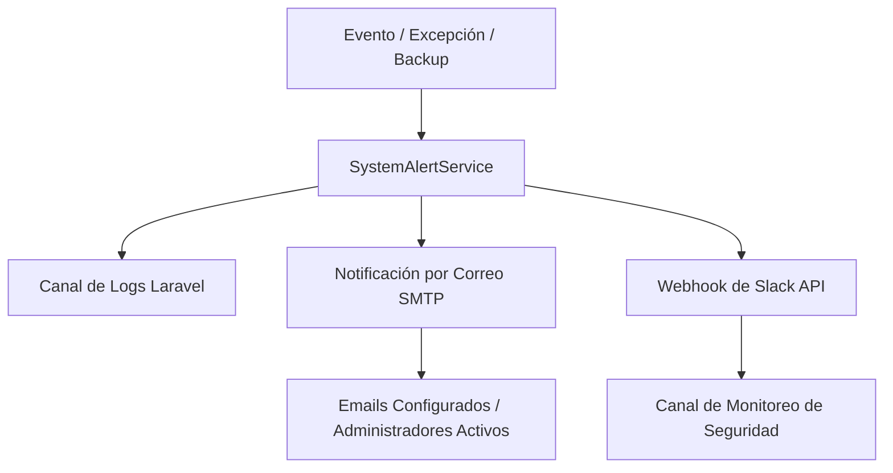

# Redacción de Secciones de Informe de Prácticas (sistemas-doc1)

A continuación se detalla la documentación técnica redactada de forma académica y profesional correspondiente a las secciones **3.2.19** a **3.2.23** del informe de prácticas preprofesionales, alineadas directamente con el desarrollo e implementación real del sistema **sistemas-doc1** (UGEL).

---

## 3.2.19. Registros de exportes y controles de envío

El sistema implementa un robusto módulo de procesamiento y exportación de datos de matrícula estudiantil en el servidor (Laravel) que se comunica directamente con la interfaz de usuario en React. Este módulo se encuentra encapsulado en el controlador `MatriculaController` y en el servicio principal `MatriculaService`.

### Lógica de Procesamiento y Clasificación de Matrículas
Cuando un usuario sube un archivo Excel con el padrón de matrículas del distrito (formatos admitidos `.xlsx` y `.xls`), el método `procesarArchivo` del servicio realiza los siguientes pasos y controles:

1. **Detección Automática de Formato y Nivel**: A través de `detectarFormato()`, el sistema analiza el título de la hoja y las filas superiores del Excel para determinar el nivel educativo (Inicial, Primaria o Secundaria), aplicando las plantillas de mapeo preestablecidas o utilizando perfiles de entrenamiento previamente cargados mediante `ExcelFormatTrainingService`.
2. **Filtro de Selección Activa**: Se limpian las filas vacías y se descartan de forma automática los registros de instituciones educativas cuya matrícula en proceso sea igual a cero:
   $$\text{Filtro de Registro} = \{ r \in \text{Registros} \mid r.\text{MATRICULA\_EN\_PROCESO} > 0 \}$$
   Esto optimiza los reportes enfocando la atención de la UGEL únicamente en las instituciones que tienen trámites pendientes.
3. **Clasificación por Gestión/Modalidad**: El sistema determina si la institución es pública o privada basándose en las siglas iniciales del campo `TIPO_IE`. Las instituciones que inician con los códigos `A1`, `A2`, `A3` o `A4` se clasifican bajo la modalidad **PÚBLICO**; en caso contrario, se catalogan como **PRIVADO**.
4. **Agrupación Geográfica (Distritos)**: Los registros resultantes se agrupan en colecciones indexadas por el campo `DISTRITO` (ej. Catacaos, Piura, Castilla, Veintiséis de Octubre).

### Generación Dinámica de Archivos de Reporte
Para cada distrito y modalidad clasificada, el sistema genera de forma autónoma un nuevo libro de Excel utilizando la librería `PhpOffice\PhpSpreadsheet`. La estructura estética y funcional de estos reportes incluye:
* **Cabecera Personalizada y Código de Colores**: Un bloque superior fusionado con un color representativo de la modalidad administrativa: **Azul corporativo** (`#1A56DB`) con fondo de datos celeste (`#EFF6FF`) para el ámbito público, y **Púrpura corporativo** (`#7E22CE`) con fondo de datos violeta (`#F5F3FF`) para el ámbito privado.
* **Resaltado Dinámico de Columnas**: Las columnas críticas especificadas por el usuario al procesar el archivo (como "Matrícula en Proceso") se destacan mediante un fondo amarillo (`#FEF9C3`) y fuentes en color marrón oscuro para facilitar su identificación rápida.
* **Cálculo de Totales Integrado**: Se inserta una última fila denominada "TOTAL" donde se realiza la sumatoria automática de todos los campos numéricos (estudiantes matriculados, DNI validado, secciones, etc.), utilizando fórmulas de cálculo optimizadas en el backend.
* **Almacenamiento Estructurado**: Los archivos finales se almacenan en el disco interno del servidor bajo una jerarquía estricta de directorios:
  `storage/app/matricula_output/{MODALIDAD}/{DISTRITO}/MATRICULA_{NIVEL}_{MODALIDAD}_{DISTRITO_SLUG}.xlsx`

### Controles de Envío y Despacho (Descarga en ZIP y PDF)
Para agilizar la transmisión y el control del envío de información procesada a los especialistas de la UGEL, el sistema expone tres endpoints de descarga clave:
1. **Descarga de Excel Individual (`descargar()`)**: Permite la descarga directa del libro de Excel generado para un distrito y modalidad específicos, recuperado mediante su ruta codificada en Base64.
2. **Generación y Descarga de PDF (`descargarPdf()`)**: Mediante la librería **Dompdf**, el método `generarPdfDesdeExcel()` lee el archivo de Excel guardado, extrae los totales y renderiza en memoria la vista HTML `pdf.reporte_matricula` en orientación horizontal (A4 Landscape), devolviendo un documento PDF listo para impresión y firma oficial.
3. **Despacho Consolidado en ZIP (`descargarZip()`)**: Utilizando la extensión nativa `ZipArchive`, el sistema recorre recursivamente el directorio de salida `storage/app/matricula_output` y empaqueta la totalidad de archivos de Excel respetando la estructura de carpetas (Público/Privado y Distritos), generando un archivo único comprimido (`matricula_YYYY-MM-DD.zip`). Este archivo comprimido actúa como el "paquete de despacho" listo para ser enviado a las áreas correspondientes.

---

## 3.2.20. Generación de alertas y notificaciones del sistema

El sistema incorpora un servicio centralizado de notificación y gestión de excepciones denominado `SystemAlertService`, diseñado para mantener informados a los usuarios administradores ante incidentes críticos de infraestructura, errores de ejecución o eventos administrativos de alta prioridad.

### Arquitectura de Alertas
El servicio encapsula la lógica para despachar notificaciones a través de múltiples canales simultáneos, basándose en la configuración definida en el entorno de producción (`.env`):



### Canales de Comunicación Implementados
1. **Registro en Logs de Sistema**: Cada alerta es registrada en el canal de logs configurado en la variable `ADMIN_ALERT_LOG_CHANNEL` (generalmente canal `stack` que escribe en `storage/logs/laravel.log`) mediante el nivel de gravedad `error`, guardando el título del evento y el contexto técnico en formato JSON.
2. **Notificación por Correo Electrónico (SMTP)**:
   * **Notificación Externa (`sendEmails`)**: Envía correos con la traza detallada del suceso a las direcciones especificadas en la variable `ADMIN_ALERT_EMAILS` (ej. `admin@dominio.com`, `seguridad@dominio.com`).
   * **Notificación Interna (`notifyAdmins`)**: Recupera en tiempo real todos los usuarios de la base de datos que poseen roles administrativos (`super_admin` y `sub_admin`) y que están activos (`is_active = true`), y les envía un correo electrónico de alerta de forma directa.
3. **Integración con Slack Webhooks**: Permite la publicación asíncrona de mensajes enriquecidos en un canal dedicado de Slack mediante peticiones POST rápidas (`Http::timeout(5)->post()`) a la URL configurada en `ADMIN_SLACK_WEBHOOK_URL`.

### Eventos Críticos Notificados
El sistema dispara alertas automáticamente bajo las siguientes circunstancias:
* **Fallas del Sistema y Excepciones (`reportException`)**: Captura cualquier error no controlado ocurrido en el backend de la aplicación, registrando el mensaje de error, archivo de origen, línea afectada, URL de la petición, método HTTP, dirección IP del usuario y el ID del usuario autenticado para facilitar la depuración inmediata.
* **Fallas en Copias de Seguridad (`safeCreateBackup`)**: Si el proceso de generación automática o manual del backup del sistema falla, se envía una notificación inmediata detallando el error en la base de datos o en el almacenamiento físico.
* **Intentos de Intrusión o Bloqueo**: Notificación cuando una dirección IP excede el máximo de intentos de inicio de sesión (`ADMIN_MAX_LOGIN_ATTEMPTS`) y es bloqueada por seguridad.

---

## 3.2.21. Auditoría de operaciones y logs de seguridad

El sistema satisface las exigencias de control interno y rendición de cuentas de la UGEL mediante un subsistema de auditoría inmutable. Este módulo registra detalladamente las interacciones realizadas en los módulos del sistema y es operado a través del servicio `AuditLogService` y el modelo de datos `AuditLog`.

### Estructura del Registro de Auditoría
Cada evento registrado en la base de datos almacena información exhaustiva de la transacción:
* **Identificación del Actor (`actor_id`)**: Llave foránea del usuario autenticado que ejecutó la acción (ej. ID del administrador).
* **Identificador de Acción (`action`)**: Cadena de texto descriptiva y estandarizada del evento (ej. `auth.login.success`, `admin.backup.restored`, `admin.user.created`).
* **Sujeto de Acción (`subject_type` y `subject_id`)**: Mapeo polimórfico de Eloquent que vincula la acción al registro exacto afectado en la base de datos (por ejemplo, el modelo `User` con ID `5`).
* **Etiqueta del Destinatario (`target_label`)**: Nombre legible del recurso afectado (ej. correo del usuario modificado o nombre del archivo de copia de seguridad).
* **Dirección IP (`ip_address`)**: Dirección IP desde donde se realizó la petición, permitiendo auditorías de geolocalización.
* **Agente de Usuario (`user_agent`)**: Cadena de texto que identifica el navegador, sistema operativo y dispositivo del cliente.
* **Metadatos JSON (`metadata`)**: Campo flexible que guarda un objeto JSON con las variables del estado anterior y posterior de los registros modificados para un análisis forense de datos.

### Acciones Auditadas Estandarizadas
El sistema registra obligatoriamente los siguientes eventos:
1. **Seguridad y Acceso**: Inicio de sesión exitoso, fallos de autenticación, generación y verificación de desafíos MFA de doble factor por correo electrónico, y bloqueos de cuenta.
2. **Gestión de Personal**: Creación, edición, suspensión temporal (`toggleStatus`) o eliminación lógica de usuarios administradores y operadores de la UGEL.
3. **Gestión del Sistema**: Carga y entrenamiento de formatos de plantillas Excel (`excel_format_profiles.json`).
4. **Respaldos e Integridad**: Generación de copias de seguridad de datos y eventos de restauración total de la base de datos.
5. **Moderación de Contenidos**: Creación, actualización o moderación de publicaciones institucionales.

### Interfaz del Panel de Auditoría
El panel web administrativo (`AdminControlPanel.jsx` y `AuditLogController`) proporciona una interfaz segura para los analistas de TI de la UGEL, permitiendo:
* Visualización en tiempo real de los logs de auditoría ordenados cronológicamente.
* Filtros de búsqueda avanzados por actor, rango de fechas, dirección IP y tipo de acción ejecutada.
* Exportación de reportes de auditoría para revisiones de seguridad y cumplimiento normativo.

---

## 3.2.22. Respaldos y restauración del sistema (Backups y restauración)

Para mitigar los riesgos de pérdida de datos debidos a fallos del hardware, errores humanos o ciberataques en la UGEL, el sistema implementa una solución nativa de copias de seguridad y recuperación transaccional mediante el servicio `AdminBackupService` y el controlador `AdminBackupController`.

### Generación de Copias de Seguridad (`createBackup`)
El proceso recopila el estado completo de la base de datos y la configuración del sistema para generar un archivo comprimido portable:
1. **Extracción de Datos**: Se consultan y estructuran en un arreglo asociativo todos los registros de los modelos críticos: `User` (usuarios del sistema), `SystemContent` (contenidos del panel), `AuditLog` (historial inmutable de operaciones), y `LoginChallenge` (retos MFA de seguridad).
2. **Carga de Perfiles de Formato**: Se lee el archivo físico `storage/app/excel_format_profiles.json` que contiene las estructuras entrenadas de los archivos Excel de matrícula de la UGEL.
3. **Escritura y Serialización**: Los datos consolidados se convierten a un archivo de formato JSON estructurado (`JSON_PRETTY_PRINT`) para facilitar auditorías humanas del backup.
4. **Almacenamiento Físico Seguro**: El archivo resultante se escribe utilizando la fachada `Storage` en el disco y ruta configurados (habitualmente disco `local` en la ruta `/private/admin_backups/admin_backup_YYYYMMDD_HHMMSS.json`).
5. **Registro de Backup**: Se crea un registro en la tabla `admin_backups` con el tamaño en bytes del archivo, ruta de almacenamiento, estado (`completed`), y el ID del administrador creador. Finalmente, el evento `admin.backup.created` se registra en la auditoría inmutable.

### Automatización de Copias de Seguridad
Mediante la programación de tareas de Laravel (`Console/Kernel.php`), el programador del servidor ejecuta diariamente en segundo plano el comando de consola:
```bash
php artisan admin:backup
```
Este comando corre a la hora configurada en la variable de entorno `ADMIN_BACKUP_SCHEDULE` (por defecto, `02:00` horas), asegurando respaldos diarios en horarios de baja demanda transaccional.

### Proceso de Restauración Transaccional (`restoreBackup`)
La restauración de una copia de seguridad es una operación altamente crítica y de acceso restringido (exige permiso `admin.backups.restore`). Para evitar la corrupción de datos ante cortes de energía o errores en la restauración, el sistema emplea una **transacción de base de datos** (`DB::transaction`) que ejecuta las siguientes fases consecutivas:

1. **Lectura y Validación**: Se recupera el contenido del JSON del disco y se valida su sintaxis y campos obligatorios.
2. **Purgado de Datos**: Se eliminan todos los registros de las tablas activas: `personal_access_tokens` (tokens de sesión), `login_challenges` (desafíos MFA), `system_contents` (contenidos), `audit_logs` (logs de auditoría) y `users` (usuarios).
3. **Revocación Inmediata de Sesiones**: Al vaciar la tabla `personal_access_tokens`, todas las sesiones activas en navegadores (React frontend) quedan invalidadas de inmediato. Esto garantiza que ningún usuario opere con un estado de sesión inconsistente posterior a la restauración.
4. **Inserción de Datos Respaldados**: Se reinsertan los registros en cada tabla. Mediante la función `filterColumns()`, el sistema consulta el esquema de la base de datos y filtra cualquier propiedad obsoleta del JSON, garantizando la compatibilidad del backup con futuras migraciones de base de datos.
5. **Restauración de Configuración Física**: Se sobreescribe el archivo `storage/app/excel_format_profiles.json` con los esquemas de Excel recuperados.
6. **Auditoría de Recuperación**: El backup se marca como restaurado, guardando la fecha y el ID del usuario ejecutor, y se graba la auditoría de éxito en la base de datos restaurada.

---

## 3.2.23. Pruebas integrales del sistema completo

Con el fin de garantizar la estabilidad, confidencialidad y el correcto funcionamiento conjunto de todos los módulos del aplicativo del procesamiento de matrículas de la UGEL, se estableció un plan de pruebas estructurado en dos categorías: pruebas automatizadas y pruebas manuales extremo a extremo (E2E).

### Pruebas Automatizadas de Integración
El backend en Laravel cuenta con suites de pruebas ejecutadas a través del motor de pruebas PHPUnit. El comando principal para validar los controladores, middlewares y servicios es:
```bash
php artisan test
```
Estas pruebas cubren:
* **Pruebas de Autenticación y MFA**: Simulación de login con credenciales correctas e incorrectas, generación del desafío MFA, validación de códigos de 6 dígitos expirados y correctos, y bloqueo de IPs por fuerza bruta.
* **Pruebas de Control de Acceso (RBAC)**: Verificación de que usuarios con rol `user` no tengan acceso a las rutas prefijadas con `/api/admin/*`, y que solo `super_admin` pueda realizar restauraciones de copias de seguridad.
* **Pruebas de Procesamiento de Archivo**: Envío de archivos Excel simulados (`UploadedFile::fake()->create()`) para asegurar el reconocimiento de cabeceras de Inicial, Primaria y Secundaria, la correcta separación de registros en carpetas públicas/privadas, y el retorno de excepciones en formatos corruptos.

### Pruebas Manuales Extremo a Extremo (E2E)
Las pruebas manuales simulan el flujo de trabajo real ejecutado por el personal de TI y los especialistas de la UGEL, divididas en los siguientes casos de prueba integrales:

| ID de Prueba | Módulo Evaluado | Descripción del Caso de Prueba | Resultado Esperado |
| :--- | :--- | :--- | :--- |
| **E2E-001** | Carga y Mapeo de Archivo Excel | Cargar padrón de matrícula en formato `.xlsx` con columnas alteradas y sin formato previo en `UploadZone.jsx`. | El sistema detecta y sugiere las columnas. Permite guardar la plantilla mediante `guardarFormato()` y previsualiza las 12 primeras filas en `PreviewTable.jsx`. |
| **E2E-002** | Procesamiento y Exportación | Procesar padrón de matrículas del distrito de Catacaos de nivel Primaria con la opción de resaltar la columna "DNI sin Validar". | Se genera una carpeta `PRIVADO` y otra `PUBLICO` en el servidor. Dentro de cada una, se crea el archivo Excel correspondiente al distrito, con estilos visuales diferenciados (azul/morado), columnas críticas amarillas y fila de totales sumada al final. |
| **E2E-003** | Consolidación y Envío | Descargar reporte consolidado en PDF de un distrito y descargar la estructura completa en formato comprimido ZIP. | El reporte PDF se descarga en formato horizontal (A4 landscape) estructurado y con formato. El archivo ZIP contiene la jerarquía correcta de carpetas de modalidades y archivos de distritos. |
| **E2E-004** | Seguridad (Login + MFA) | Autenticarse en el login React con credenciales de administrador con variable de entorno MFA habilitada. | El sistema detiene el login y solicita código MFA. El código es recibido en logs/correo. Al ingresarlo, se concede el token Sanctum en el frontend con fecha de expiración y redirección al panel. |
| **E2E-005** | Copias de Seguridad y Recuperación | Generar copia de seguridad desde el panel web, alterar la tabla de usuarios agregando un usuario falso, y ejecutar la restauración del backup. | La copia de seguridad se guarda físicamente en `/private/admin_backups`. Tras presionar "Restaurar", el sistema realiza la transacción, vacía las tablas y restaura el estado original. La sesión activa se cierra automáticamente. Al loguearse nuevamente, el usuario falso ya no existe en la base de datos. |
| **E2E-006** | Registro de Auditoría | Realizar las acciones de procesamiento, login, backup y restauración de pruebas anteriores y acceder al panel de auditoría. | El panel de auditoría muestra un registro cronológico e inmutable por cada acción ejecutada, reflejando de manera correcta la dirección IP, metadatos JSON y navegador del operador. |
